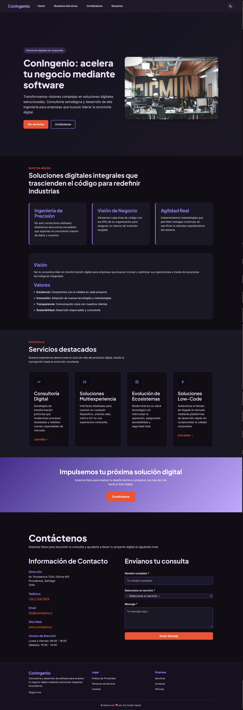

# ConIngenio - Página Web de Consultoría y Desarrollo de Software

## Descripción del Proyecto

ConIngenio es una página web moderna y responsiva para una empresa de consultoría y desarrollo de software. El proyecto fue desarrollado como parte de la Evaluación Sumativa Nº 1 de la asignatura "Desarrollo Frontend".

## Datos del Estudiante
- Ain Cortés Catoni
- Asignatura: Desarrollo front-end
- Sección: 51
- Docente: Ana Claribet

## Datos del sitio web
Puedes revisar el sitio web desplegado en github pages: https://aincatoni.github.io/frontend_eva1_cortes_ain

## Características Principales

### 🎨 Diseño Responsivo
- Optimizado para iPhone 14 Pro Max, Samsung Galaxy S20 Ultra, iPad Air, iPad Pro y Desktop
- Puntos de quiebre estratégicos: mobile, tablet pequeño, tablet, desktop
- Fluido y adaptable a cualquier tamaño de pantalla

### 🌓 Tema Día/Noche
- Toggle integrado en la navegación
- Persiste la preferencia del usuario en localStorage
- Respeta la preferencia del sistema operativo
- Colores optimizados para ambos temas

### 📝 Formulario de Contacto Completo
- Validaciones robustas en tiempo real
- Campos: Nombre completo, Servicio, Mensaje
- Retroalimentación visual de errores
- Console.log de datos enviados
- Limpieza automática post-envío

### ♿ Accesibilidad
- Etiquetas semánticas HTML5
- Atributos ARIA para lectores de pantalla
- Focus visible en elementos interactivos
- Contraste de colores suficiente
- Navegación por teclado

### 🚀 Interactividad con JavaScript
- Menú móvil desplegable
- Validaciones de formulario
- Manejo de tema
- Estado centralizado de la aplicación

### 🖌️ Maquetas
https://www.figma.com/proto/0rfrdCSEpgFu94JrMpBwrs/Congenio-CL?node-id=0-1&t=83WYYEzbCNU86R3S-1

### 📸 Captura del sitio

